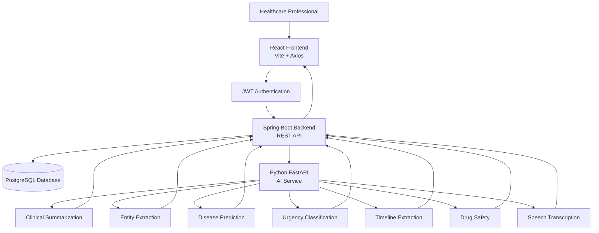
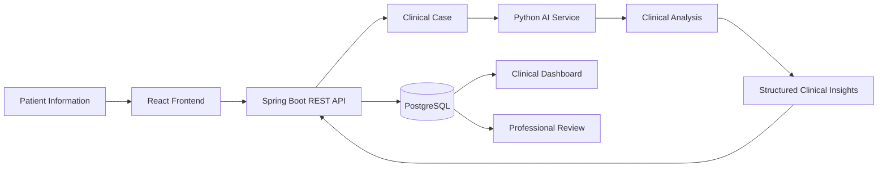
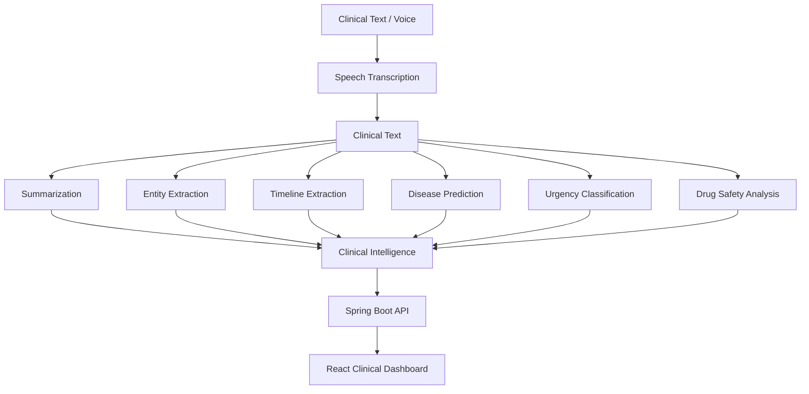
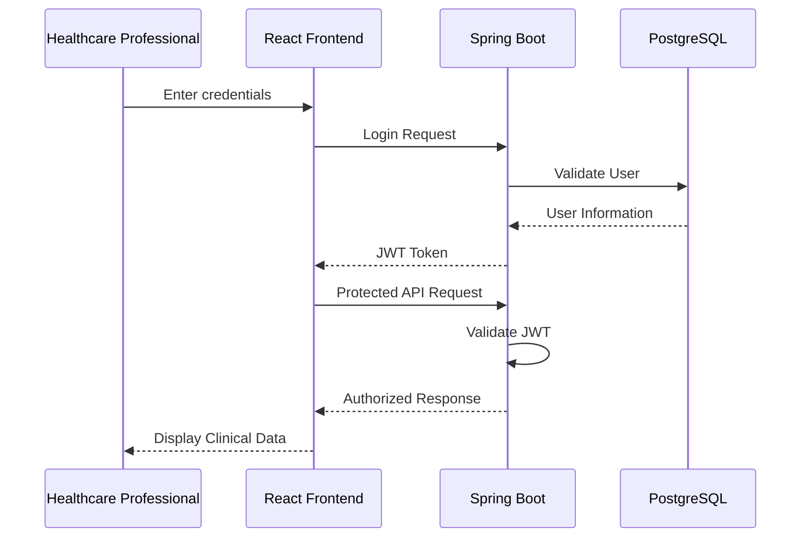
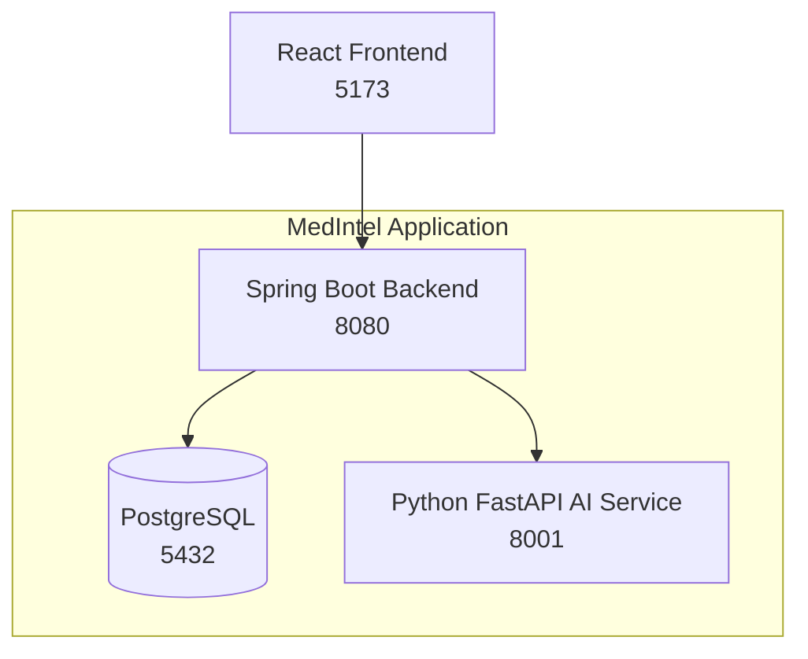
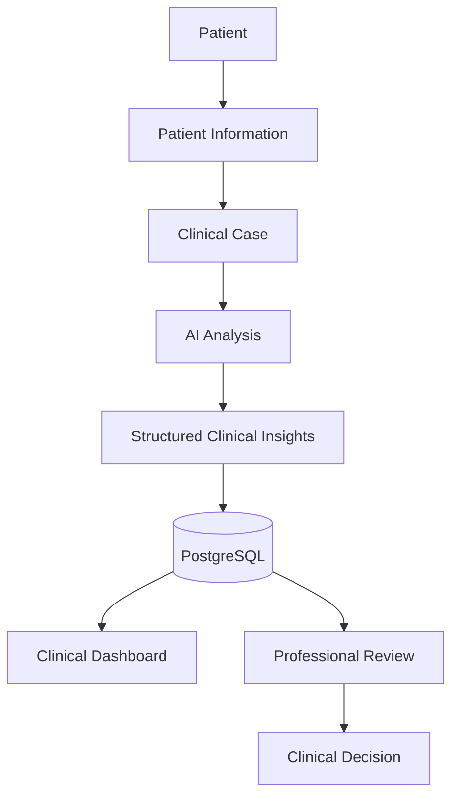

# 🏥 MedIntel

# AI-Powered Clinical Triage & Decision Support Platform

<p align="center">

### Understand Clinical Data • Structure Patient Information • Assist Clinical Decisions

</p>

<p align="center">


</p>

<p align="center">


</p>

---

## 🧠 About

**MedIntel** is a full-stack **AI-powered Clinical Triage & Decision Support Platform** designed to transform unstructured patient information into structured clinical insights.

The platform combines a **React frontend**, **Spring Boot backend**, **PostgreSQL database**, and an independent **Python FastAPI AI service** into a unified clinical workflow.

MedIntel is designed to assist healthcare professionals with:

- 🏥 Clinical case management
- 👤 Patient information management
- 🤖 AI-assisted clinical analysis
- 📝 Clinical summarization
- 🧬 Medical entity extraction
- 🧠 Disease prediction
- ⚠️ Urgency classification
- 🕐 Clinical timeline extraction
- 💊 Drug safety analysis
- 📝 Doctor notes
- 📄 Clinical reports
- 🔎 Clinical search
- 🛡️ Audit logging
- 📊 Dashboard analytics
- 🔐 Secure authentication and authorization

> **Important:** MedIntel is a clinical decision-support system. AI-generated information is intended to assist qualified healthcare professionals and does not replace professional medical diagnosis, clinical judgment, or emergency medical care.

---

# ✨ Vision

MedIntel follows a simple principle:

```text
                 UNSTRUCTURED
               PATIENT INFORMATION
                        │
                        ▼
                AI-ASSISTED ANALYSIS
                        │
          ┌─────────────┼─────────────┐
          │             │             │
          ▼             ▼             ▼
      Summary       Entities       Timeline
          │             │             │
          └─────────────┼─────────────┘
                        ▼
                Clinical Insights
                        │
                        ▼
                 Risk / Urgency
                        │
                        ▼
             Professional Review
                        │
                        ▼
              Clinical Decision
```

The objective is not to replace healthcare professionals.

The objective is to **organize complex clinical information, reduce information overload, and provide explainable decision-support insights.**

---

# 🚀 Features

## 🔐 Authentication & Security

- Secure user authentication
- JWT-based authentication
- Protected REST APIs
- Role-based authorization
- Doctor access
- Admin access
- Protected clinical information
- Audit logging
- Secure API communication
- Centralized authentication handling

---

## 👤 Patient Management

- Patient registration
- Patient information management
- Patient details
- Patient-linked clinical cases
- Patient history
- Patient activity
- Clinical information organization

---

## 🏥 Clinical Case Management

- Create clinical cases
- Store raw patient information
- Structured clinical information
- AI-generated summaries
- Extracted symptoms
- Risk factors
- Medications
- Body parts
- Clinical timeline
- Urgency classification
- Clinical reasoning
- Case status
- Case review workflow

---

# 🤖 AI Intelligence

MedIntel contains a dedicated **Python FastAPI AI service** responsible for clinical intelligence and analysis.

### AI modules include:

### 📝 Clinical Summarization

Converts unstructured patient information into a structured clinical summary.

### 🧬 Entity Extraction

Extracts relevant clinical entities such as:

- Symptoms
- Risk factors
- Medications
- Body parts
- Other clinically relevant information

### 🧠 Disease Prediction

Provides disease-related prediction based on available clinical information.

### ⚠️ Urgency Classification

Classifies potential urgency into levels such as:

```text
Critical
High
Medium
Low
```

The output is treated as a **possible clinical concern requiring professional evaluation**, not a diagnosis.

### 🕐 Timeline Extraction

Extracts clinically relevant events and organizes them chronologically.

### 💊 Drug Safety

Provides medication-related safety information and potential concerns.

### 🎙️ Transcription

Provides a dedicated transcription module for voice-based clinical input.

---

# 📊 Clinical Dashboard

The MedIntel dashboard provides a centralized overview of clinical activity.

### Dashboard capabilities include:

- Total patients
- Total clinical cases
- Critical cases
- High-risk cases
- Medium-risk cases
- Low-risk cases
- Case activity
- Clinical trends
- Risk distribution
- Patient activity
- Case analytics

The dashboard consumes data through the backend REST API.

---

# 🕐 Clinical Timeline

The timeline module organizes patient information chronologically.

It can represent:

- Patient history
- Clinical events
- Case creation
- AI analysis
- Risk assessment
- Doctor observations
- Clinical review
- Other clinical events

This allows healthcare professionals to understand the progression of a patient's case more easily.

---

# 📝 Doctor Notes

The Doctor Notes module allows healthcare professionals to maintain structured clinical observations.

It supports:

- Doctor observations
- Clinical remarks
- Patient-specific notes
- Case-linked notes
- Historical notes
- Detailed doctor note information

---

# 💊 Drug Safety

The Drug Safety module provides medication-related decision-support information.

It can be used to represent:

- Drug interactions
- Medication warnings
- Safety findings
- Potential medication concerns
- Drug-related clinical information

---

# 📄 Clinical Reports

MedIntel brings information from multiple clinical modules together into structured reports.

```text
Patient
   │
   ├── Clinical Case
   ├── AI Summary
   ├── Extracted Entities
   ├── Disease Prediction
   ├── Urgency
   ├── Timeline
   ├── Doctor Notes
   └── Drug Safety
          │
          ▼
     Clinical Report
```

---

# 🔎 Clinical Search

The Search module provides centralized access to clinical information.

The backend exposes dedicated REST endpoints for searching clinical cases and related information.

---

# 🛡️ Audit Logs

MedIntel includes an Audit Log module for application activity tracking.

Audit information supports:

- Accountability
- Administrative monitoring
- Security traceability
- User activity tracking
- System review

---

# 🏗️ System Architecture



---

# 🔄 End-to-End Clinical Workflow



---

# 🧠 AI Processing Pipeline



---

# 🔐 Authentication Flow



---

# 🧩 Technology Stack

| Category | Technologies |
|---|---|
| 🎨 Frontend | React, Vite, Axios |
| ⚙️ Backend | Java, Spring Boot |
| 🧠 AI | Python, FastAPI |
| 🗄️ Database | PostgreSQL |
| 🔐 Authentication | JWT |
| 🧬 Persistence | JPA / Hibernate |
| 📦 Build | Maven |
| 🐳 Containerization | Docker, Docker Compose |
| 🔌 Communication | REST API / JSON |
| 🤖 AI Modules | Summarization, NER, Disease Prediction, Urgency, Timeline, Drug Safety, Transcription |

---

# 🔌 Backend API Architecture

The Spring Boot backend acts as the central application layer between the React frontend, PostgreSQL database, and Python AI service.

## Backend Controllers

| Controller | Responsibility |
|---|---|
| `AuthController` | Authentication |
| `CaseController` | Clinical case management |
| `DashboardController` | Dashboard analytics |
| `TimelineController` | Clinical timeline |
| `DoctorNoteController` | Doctor notes |
| `DoctorNoteDetailController` | Detailed doctor notes |
| `DrugSafetyController` | Drug safety |
| `ReportController` | Clinical reports |
| `SearchController` | Clinical search |
| `AuditLogController` | Audit logging |

---

# 🌐 Frontend ↔ Backend Communication

```text
                 React Frontend
                       │
                       │ Axios
                       ▼
                Spring Boot API
                       │
             ┌─────────┴─────────┐
             │                   │
             ▼                   ▼
      PostgreSQL Database   Python AI Service
                                 │
                    ┌────────────┼────────────┐
                    ▼            ▼            ▼
                 NLP/NER      Prediction   Analysis
```

The frontend communicates with the **Spring Boot backend** rather than directly communicating with the Python AI service.

This keeps business logic, authentication, persistence, and AI orchestration centralized within the backend.

---

# 📁 Project Structure

```text
MedIntel/
│
├── spring-backend/
│   │
│   ├── src/
│   │   └── main/
│   │       ├── java/
│   │       │   └── com/
│   │       │       └── medintel/
│   │       │           │
│   │       │           ├── controller/
│   │       │           │   ├── AuditLogController.java
│   │       │           │   ├── AuthController.java
│   │       │           │   ├── CaseController.java
│   │       │           │   ├── DashboardController.java
│   │       │           │   ├── DoctorNoteController.java
│   │       │           │   ├── DoctorNoteDetailController.java
│   │       │           │   ├── DrugSafetyController.java
│   │       │           │   ├── ReportController.java
│   │       │           │   ├── SearchController.java
│   │       │           │   └── TimelineController.java
│   │       │           │
│   │       │           ├── service/
│   │       │           ├── repository/
│   │       │           ├── entity/
│   │       │           └── security/
│   │       │
│   │       └── resources/
│   │
│   ├── pom.xml
│   └── Dockerfile
│
├── python-ai-service/
│   │
│   ├── app/
│   │   ├── disease_predictor.py
│   │   ├── drug_safety.py
│   │   ├── main.py
│   │   ├── ner.py
│   │   ├── summarizer.py
│   │   ├── timeline_extraction.py
│   │   ├── transcribe.py
│   │   ├── urgency.py
│   │   └── __init__.py
│   │
│   ├── requirements.txt
│   └── Dockerfile
│
├── docker-compose.yml
├── README.md
└── .gitignore
```

---

# 🐳 Docker Architecture

MedIntel uses Docker Compose to orchestrate the backend services.



## Service Configuration

| Service | Technology | Port |
|---|---|---:|
| Frontend | React + Vite | `5173` |
| Backend | Spring Boot | `8080` |
| AI Service | Python FastAPI | `8001` |
| Database | PostgreSQL | `5432` |

---

# ⚙️ Application Configuration

### PostgreSQL

```text
Database : medintel
Username : medintel
Port     : 5432
```

### Spring Boot

```text
Server Port : 8080
```

### Python AI Service

```text
Service Port : 8001
```

### React Frontend

```text
Development Port : 5173
```

---

# 🚀 Getting Started

## Prerequisites

Install:

- Git
- Node.js
- npm
- Java 17+
- Maven
- Python 3.10+
- Docker Desktop

---

## 1. Clone Repository

```bash
git clone https://github.com/ITSMEANVITH/MedIntel.git
cd MedIntel
```

---

## 2. Start Backend Services

```bash
docker compose up --build
```

This starts:

```text
PostgreSQL   → localhost:5432
AI Service   → localhost:8001
Spring Boot  → localhost:8080
```

---

## 3. Start React Frontend

Navigate to the frontend project and install dependencies:

```bash
npm install
```

Start the development server:

```bash
npm run dev
```

Frontend:

```text
http://localhost:5173
```

---

# 🧪 Local Development

```text
                  Developer
                      │
                      ▼
                React Frontend
                  :5173
                      │
                      ▼
              Spring Boot API
                  :8080
                 /       \
                /         \
               ▼           ▼
       PostgreSQL       FastAPI AI
           :5432            :8001
```

---

# 🔒 Security

MedIntel incorporates security at multiple application layers.

### Authentication

- JWT authentication
- Secure credential validation
- Token-based API access

### Authorization

- Role-based access control
- Protected endpoints
- Doctor authorization
- Administrative authorization

### API Security

- Protected REST endpoints
- Bearer-token authentication
- Backend-side authorization
- Centralized authentication handling

### Credential Protection

API keys, database credentials, JWT secrets, and other sensitive values should be provided through environment variables and should never be committed to Git.

---

# 📊 Clinical Data Flow



---

# 🏥 Clinical Case Lifecycle

```text
Create Patient
      │
      ▼
Create Clinical Case
      │
      ▼
Submit Clinical Information
      │
      ▼
AI Processing
      │
      ├── Clinical Summary
      ├── Entity Extraction
      ├── Timeline
      ├── Disease Prediction
      ├── Urgency Classification
      └── Drug Safety
      │
      ▼
Persist Results
      │
      ▼
Clinical Dashboard
      │
      ▼
Professional Review
      │
      ▼
Clinical Decision Support
```

---

## 📸 Screenshots

MedIntel provides a modern clinical decision-support interface designed for healthcare professionals to manage patient information, clinical cases, timelines, AI-assisted insights, reports, and administrative workflows.

### 🔐 Login

Secure authentication interface for authorized healthcare professionals.

<p align="center">
  
</p>

---

### 📊 Dashboard

The central clinical dashboard providing an overview of patient activity, cases, urgency distribution, and key clinical statistics.

<p align="center">
  
</p>

---

### 🏥 Clinical Case

Clinical case management interface for reviewing patient information, extracted clinical insights, urgency indicators, and case details.

<p align="center">
  
</p>

---

### 👤 Patient Information

Patient information interface for viewing structured patient details and associated clinical information.

<p align="center">
  
</p>

---

### ⏱️ Clinical Timeline

Timeline-based visualization of important patient events and clinical activities.

<p align="center">
  
</p>

---

### 📝 Doctor Notes

Clinical documentation interface for creating and managing physician notes associated with patient cases.

<p align="center">
  
</p>

---

### 💊 Drug Safety

Drug safety analysis interface for reviewing medication-related safety information and potential concerns.

<p align="center">
  
</p>

---

### 📄 Clinical Reports

Clinical reporting interface for reviewing and managing generated patient and case reports.

<p align="center">
  
</p>

---

## 🧩 Core Clinical Workflow

```text
                    ┌───────────────────────┐
                    │     Doctor Login      │
                    └───────────┬───────────┘
                                │
                                ▼
                    ┌───────────────────────┐
                    │      Dashboard        │
                    └───────────┬───────────┘
                                │
              ┌─────────────────┼─────────────────┐
              │                 │                 │
              ▼                 ▼                 ▼
       Clinical Cases      Patients          Timeline
              │                 │                 │
              └─────────────────┼─────────────────┘
                                │
                                ▼
                    ┌───────────────────────┐
                    │    AI-Assisted        │
                    │ Clinical Analysis     │
                    └───────────┬───────────┘
                                │
              ┌─────────────────┼─────────────────┐
              │                 │                 │
              ▼                 ▼                 ▼
        Doctor Notes       Drug Safety       Reports
# 🔥 Highlights

- 🤖 AI-assisted clinical intelligence
- 🧠 Modular AI architecture
- 🏥 Full clinical case workflow
- 👤 Patient management
- 📊 Clinical dashboard
- 🕐 Patient timeline
- 📝 Doctor notes
- 💊 Drug safety
- 📄 Clinical reports
- 🔎 Clinical search
- 🛡️ Audit logs
- 🔐 JWT authentication
- 👥 Role-based authorization
- 🔌 REST API architecture
- 🗄️ PostgreSQL persistence
- 🐍 Independent Python AI service
- 🐳 Dockerized backend architecture
- 📱 Modern React interface
- 🧩 Modular service architecture

---

# 💡 Why MedIntel?

Traditional clinical information can be scattered across:

```text
Patient Notes
     +
Symptoms
     +
Medications
     +
Clinical Events
     +
Doctor Notes
     +
Risk Factors
     +
Patient History
```

MedIntel brings these information sources into a unified workflow:

```text
                MEDINTEL
                    │
       ┌────────────┼────────────┐
       ▼            ▼            ▼
    Patient       Clinical       AI
    Data          Cases        Analysis
       │            │            │
       └────────────┼────────────┘
                    ▼
           Structured Insights
                    │
                    ▼
           Professional Review
```

---

# 🧠 Human-in-the-Loop AI

MedIntel follows a **Human-in-the-Loop** approach.

```text
             AI Analysis
                  │
                  ▼
        Possible Clinical Insight
                  │
                  ▼
       Healthcare Professional
                  │
                  ▼
        Professional Evaluation
                  │
                  ▼
         Clinical Decision
```

AI-generated information should always be reviewed by an appropriately qualified healthcare professional.

---

# 📈 Future Enhancements

Planned or potential future improvements include:

- 🧠 Advanced clinical NLP models
- 🔬 Improved disease prediction
- 📚 Expanded medical knowledge base
- 🗣️ Enhanced speech-to-text
- 📊 Advanced analytics
- 📈 Predictive patient analytics
- 🔔 Clinical notifications
- 🧬 Advanced medical entity recognition
- ☁️ Cloud deployment
- 🔄 CI/CD automation
- 🧪 Automated integration testing
- 📋 Advanced report generation
- 🔐 Fine-grained permissions
- 🧠 AI model evaluation and monitoring
- 📱 Mobile healthcare interface

---

# 👥 Contributors

<table>
<tr>

<td align="center" width="50%">

# 👨‍💻 Anvith C D

### Backend Developer & AI Integration

- Java Backend Development
- Spring Boot REST APIs
- PostgreSQL Database
- Authentication & Authorization
- Python AI Service Integration
- AI Pipeline Integration
- Docker Architecture
- Backend System Integration

</td>

<td align="center" width="50%">

# 🎨 Ranjitha S Shetty

### Frontend Developer & UI/UX Designer

- React Frontend Development
- UI/UX Design
- Responsive Interface
- Clinical Dashboard
- Frontend Components
- API Integration
- User Experience Design

</td>

</tr>
</table>

---

# 🎓 Academic Information

### Institution

**K S Institute of Technology**

### Department

**Computer Science and Design (CSD)**

### Project

**MedIntel — AI-Powered Clinical Triage & Decision Support Platform**

---

# 🔗 Links

## Backend Repository

https://github.com/ITSMEANVITH/MedIntel

## Frontend Repository

https://github.com/RanjithaSShetty05/MedIntel

---

# 🗂️ Repository Organization

MedIntel is organized into two complementary repositories.

```text
                         MEDINTEL
                            │
              ┌─────────────┴─────────────┐
              │                           │
              ▼                           ▼
      Backend Repository          Frontend Repository
       ITSMEANVITH/MedIntel      RanjithaSShetty05/MedIntel
              │                           │
       ┌──────┴──────┐                    │
       │             │                    │
       ▼             ▼                    ▼
  Spring Boot   Python AI              React
       │             │                    │
       ▼             ▼                    ▼
 PostgreSQL      FastAPI                Vite
       │             │                    │
       └─────────────┴────────────────────┘
                       │
                       ▼
               Clinical Platform
```

---

# 🌟 Project Highlights

```text
╔══════════════════════════════════════════════════════╗
║                      MEDINTEL                        ║
║                                                      ║
║     AI-Powered Clinical Decision Support Platform    ║
║                                                      ║
║   React + Spring Boot + Python + PostgreSQL + Docker  ║
║                                                      ║
║   Patient Management                                 ║
║   Clinical Cases                                     ║
║   AI Intelligence                                    ║
║   Disease Prediction                                 ║
║   Urgency Classification                              ║
║   Drug Safety                                        ║
║   Timeline                                           ║
║   Doctor Notes                                       ║
║   Reports                                            ║
║   Search                                             ║
║   Audit Logs                                         ║
║                                                      ║
╚══════════════════════════════════════════════════════╝
```

---

# ⭐ Support

If you found **MedIntel** interesting or useful, consider giving the repository a ⭐ on GitHub.

---

# 📄 License

This project is developed as an academic project.

See the repository license file for applicable licensing information.

---

# ❤️ Developed With

```text
Artificial Intelligence
          +
Full-Stack Engineering
          +
Healthcare Workflow Design
          +
Modern Web Technologies
          +
Secure Backend Architecture
          +
Human-Centered Decision Support
```

---

# 🏥 MedIntel

## AI-Assisted Clinical Intelligence for Better Information, Better Understanding, and Better Decisions.

<p align="center">

### Built with ❤️ by

**Ranjitha S Shetty** &nbsp; • &nbsp; **Anvith C D**

**K S Institute of Technology**

**Computer Science and Design**

</p>

---
